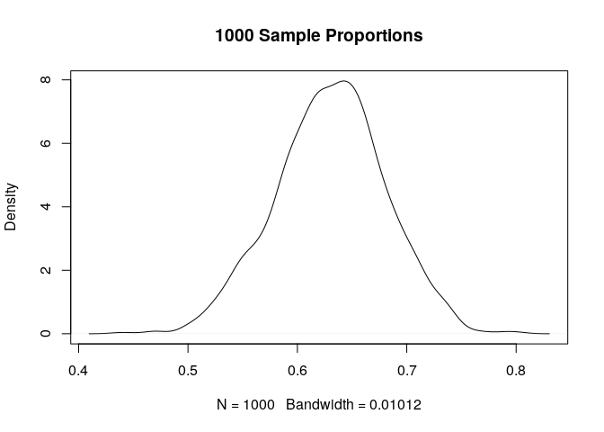

<!-- README.md is generated from README.Rmd. Please edit that file -->
ResampleProps
=============

The goal of ResampleProps is to ...

Installation
------------

The `devtools` library for R allows package installation from GitHub

``` r
devtools::install_github("robertwwalker/ResampleProps")
```

Examples
========

There are four commands of similar structure: ResampleMean, ResampleProp, ResampleDiffMeans, ResampleDiffProps. I will show an example of a single mean. The proportions calculations rely on binary data transformed to a table. There is an option `tab.col` that allows one to select which column of the proportions table is of interest. This simply owes to R's alphabetizing factors.

A Single Mean
-------------

Resampling a single mean 1000 times is easy.

``` r
library(ResampleProps)
My.LNorm.Means <- ResampleMean(rlnorm(100))
summary(My.LNorm.Means)
#>    Min. 1st Qu.  Median    Mean 3rd Qu.    Max. 
#>   1.275   1.714   1.862   1.868   2.017   2.643
```

### Plot of the Resampled Means

``` r
plot(density(My.LNorm.Means), main="1000 LogNormal Means")
```


A Single Proportion
-------------------

Resampling a single proportion 1000 times is easy.

``` r
My.Props <- ResampleProp(rbinom(100, size=1, prob = 0.4))
summary(My.Props)
#>    Min. 1st Qu.  Median    Mean 3rd Qu.    Max. 
#>  0.4400  0.6000  0.6300  0.6302  0.6600  0.8000
```

### Plot of the Resampled Proportions

``` r
plot(density(My.Props), main="1000 Sample Proportions")
```



Difference of Means
-------------------

Resampling the difference in two means.

``` r
My.LNorm.Means2 <- ResampleDiffMeans(rlnorm(100), rlnorm(100, meanlog = 0.7))
summary(My.LNorm.Means2)
#>    Min. 1st Qu.  Median    Mean 3rd Qu.    Max. 
#> -3.1594 -1.7228 -1.4049 -1.4324 -1.1260 -0.2088
```

### Plot of the Resampled Means

``` r
plot(density(My.LNorm.Means2), main="1000 Difference of Means")
```


Twp Proportions
---------------

Resampling a difference in proportions 1000 times is easy.

``` r
My.Props2 <- ResampleDiffProps(rbinom(100, size=1, prob = 0.4),rbinom(100, size=1, prob = 0.5))
summary(My.Props2)
#>    Min. 1st Qu.  Median    Mean 3rd Qu.    Max. 
#> -0.1000  0.0800  0.1300  0.1289  0.1800  0.3400
```

### Plot of the Resampled Difference in Proportions

``` r
plot(density(My.Props2), main="1000 Differences in Proportions")
```


