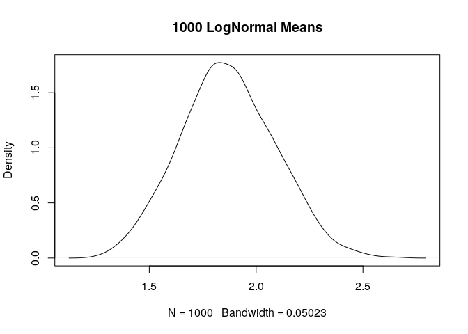

<!-- README.md is generated from README.Rmd. Please edit that file -->
ResampleProps
=============

The goal of ResampleProps is to ...

Installation
------------

The `devtools` library for R allows package installation from GitHub

``` r
devtools::install_github("robertwwalker/ResampleProps")
```

Examples
--------

There are four commands of similar structure: ResampleMean, ResampleProp, ResampleDiffMeans, ResampleDiffProps. I will show an example of a single mean. The proportions calculations rely on binary data transformed to a table. There is an option `tab.col` that allows one to select which column of the proportions table is of interest. This simply owes to R's alphabetizing factors.

### A Single Mean

Resampling a single mean 1000 times is easy.

``` r
library(ResampleProps)
My.LNorm.Means <- ResampleMean(rlnorm(100))
summary(My.LNorm.Means)
#>    Min. 1st Qu.  Median    Mean 3rd Qu.    Max. 
#>   1.016   1.762   2.012   2.061   2.300   3.753
```

A Plot of the Resampled Means

``` r
plot(density(My.LNorm.Means), main="1000 LogNormal Means")
```


